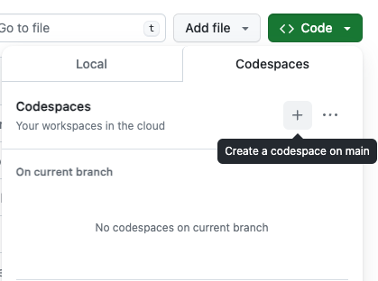

## Prerequisites

- Access to gpt3.5-turbo or preferably gpt4 - [Get access here](https://learn.microsoft.com/en-us/azure/ai-services/openai/overview#how-do-i-get-access-to-azure-openai)
- [Setup a Github app](#how-do-i-setup-the-github-app)
- [Install the Github app](https://docs.github.com/en/apps/using-github-apps/installing-your-own-github-app)
- [Provision the azure resources](#how-do-I-deploy-the-azure-bits)
- [Create labels for the dev team skills](#which-labels-should-i-create)

### How do I setup the Github app?

- [Register a Github app](https://docs.github.com/en/apps/creating-github-apps/registering-a-github-app/registering-a-github-app), with the options listed below:
    - Give your App a name and add a description
    - Homepage URL: Can be anything (Example: repository URL)
    - Add a dummy value for the webhook url, we'll come back to this setting
    - Enter a webhook secret, which you'll need later on when filling in the `WebhookSecret` property in the `appsettings.json` file
    - Setup the following permissions
        - Repository 
            - Contents - read and write
            - Issues - read and write
            - Metadata - read only
            - Pull requests - read and write
    - Subscribe to the following events:
        - Issues
        - Issue comment
    - Allow this app to be installed by any user or organization
    
- After the app is created, generate a private key, we'll use it later for authentication to Github from the app

### Which labels should I create?

In order for us to know which skill and persona we need to talk with, we are using Labels in Github Issues

The default bunch of skills and personnas are as follows:
- PM.Readme
- Do.It
- DevLead.Plan
- Developer.Implement

Once you start adding your own skills, just remember to add the corresponding Label!

## How do I run this locally?

Codespaces are preset for this repo.
Start by creating a codespace



and fill in the `appsettings.json` file, located in the `src\apps\gh-flow` folder.
There is a `appsettings.local.template.json` which you can copy and fill in, containing comments on the different config values.

In the Explorer tab in VS Code, find the Solution explorer, right click on the `gh-flow` project and click Debug -> Start new instance


We'll need to expose the running application to the GH App webhooks, for example using [DevTunnels](https://learn.microsoft.com/en-us/azure/developer/dev-tunnels/overview), but any tool like ngrok can also work.
The following commands will create a persistent tunnel, so we need to only do this once:
```bash
TUNNEL_NAME=_name_yout_tunnel_here_
devtunnel user login
devtunnel create -a $TUNNEL_NAME
devtunnel port create -p 5244 $TUNNEL_NAME
```
and once we have the tunnel created we can just start forwarding with the following command:

```bash
devtunnel host $TUNNEL_NAME
```

Copy the local address (it will look something like https://yout_tunnel_name.euw.devtunnels.ms) and append `/api/github/webhooks` at the end. Using this value, update the Github App's webhook URL and you are ready to go!

Before you go and have the best of times, there is one last thing left to do [load the WAF into the vector DB](#load-the-waf-into-qdrant)

Also, since this project is relying on Orleans for the Agents implementation, there is a [dashboard](https://github.com/OrleansContrib/OrleansDashboard) available at https://yout_tunnel_name.euw.devtunnels.ms/dashboard, with useful metrics and stats related to the running Agents.

## How do I deploy the azure bits?

This repo is setup to use  [azd](https://learn.microsoft.com/en-us/azure/developer/azure-developer-cli/overview) to work with the Azure bits. `azd` is installed in the codespace.

Let's start by logging in to Azure using
```bash
azd auth login
```

After we've logged in, we need to create a new environment provision the azure bits.

```bash
ENVIRONMENT=_name_of_your_env
azd env new $ENVIRONMENT
azd provision -e $ENVIRONMENT
```
After the provisioning is done, you can inspect the outputs with the following command

```bash
azd env get-values -e dev
```
As the last step, we also need to [load the WAF into the vector DB](#load-the-waf-into-qdrant)

### Load the WAF into Qdrant. 

If you are running the app locally, we have [Qdrant](https://qdrant.tech/) setup in the Codespace and if you are running in Azure, Qdrant is deployed to ACA.
The loader is a project in the `src\apps` folder, called `seed-memory`. We need to fill in the `appsettings.json` file in the `config` folder with the OpenAI details and the Qdrant endpoint, then just run the loader with `dotnet run` and you are ready to go.
