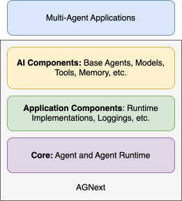

# Overview

This section provides the background and overview of AGNext.

## Multi-Agent Application

A wide variety of software applications can be modeled as a collection of independent
agents that communicate with each other through messages:
sensors on a factory floor,
distributed services powering web applications,
business workflows involving multiple stakeholders,
and more recently, artificial intelligence (AI) agents powered by language models
(e.g., GPT-4) that can write code and interact with
other software systems.
We refer to them as multi-agent applications.

In a multi-agent application, agents can live in the same process, on the same machine,
or on different machines and across organizational boundaries.
They can be implemented using different AI models, instructions, and programming languages.
They can collaborate and work toward a common goal.

Each agent is a self-contained unit:
developers can build, test and deploy it independently, and reuse it for different scenarios.
Agents are composable: simple agents can form complex applications.

## AGNext Overview

AGNext is a framework for building multi-agent applications with AI agents.
It provides a runtime envionment to facilitate communication between agents,
manage their identities and lifecycles, and enforce boundaries.
It also provides a set of common patterns and components to help developers build
AI agents that can work together.

AGNext is designed to be unopinionated and extensible.
It does not prescribe an abstraction for agents or messages, rather, it provides
a minimal base layer that can be extended to suit the application's needs.
Developers can build agents quickly by using the provided components including
type-routed agent, AI model clients, tools for AI models, code execution sandboxes,
memory stores, and more.
Developers can also make use of the provided multi-agent patterns to build
orchestrated workflows, group chat systems, and more.

The API consists of the following layers:

- {py:mod}`agnext.core`
- {py:mod}`agnext.application`
- {py:mod}`agnext.components`

The following diagram shows the relationship between the layers.

The {py:mod}`agnext.core` layer defines the
core interfaces and base classes for agents, messages, and runtime.
This layer is the foundation of the framework and is used by the other layers.

The {py:mod}`agnext.application` layer provides concrete implementations of
runtime and utilities like logging for building multi-agent applications.

The {py:mod}`agnext.components` layer provides reusable components for building
AI agents, including type-routed agents, AI model clients, tools for AI models,
code execution sandboxes, and memory stores.

The layers are loosely coupled and can be used independently. For example,
you can swap out the runtime in the {py:mod}`agnext.application` layer with your own
runtime implementation.
You can also skip the components in the {py:mod}`agnext.components` layer and
build your own components.
